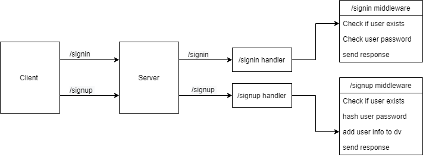

# basic-auth

## Notes:
- Implemented Express
- Connected Postgres
- Implemented Jest
- Tested before deployment
- Deployed on heroku

### Main Branch
https://omar-api-server.herokuapp.com
### Pull request
https://github.com/Omx302/basic-auth/pull/1
### Github actions
https://github.com/Omx302/basic-auth/actions/runs/1156487089
